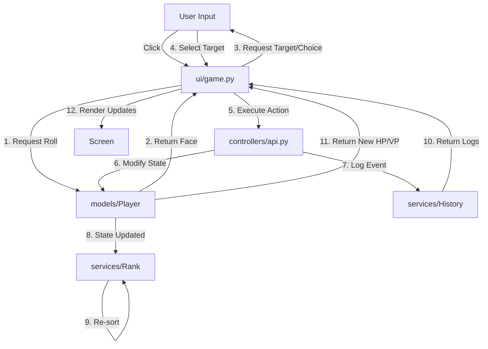

# Project Workflow & Architecture Documentation

## 1. Project Overview
**Do Or Dice** is an interactive, turn-based dice game developed in Python using `pygame-ce`. The game involves players rolling dice to attack, heal, steal victory points (VP), or perform special moves. Players can be "Alive" or "Fallen", with different abilities depending on their status. The project is designed with a clean separation between the core game logic (backend) and the graphical interface (frontend).

**Core Gameplay Loop:**
1.  **Roll Phase:** The active player rolls a dice.
2.  **Resolution Phase:** The result is applied (e.g., damage, healing). Some faces require a target selection or a strategic choice.
3.  **Update Phase:** Player stats (HP, VP) are updated, history is logged, and rankings are recalculated.
4.  **Turn End:** Control passes to the next player.
5.  **Game End:** The game concludes after a fixed number of rounds (`MAX_ROUNDS`).

---

## 2. Architectural Flow
The system follows a Model-View-Controller (MVC) inspired architecture where the UI acts as the main orchestrator for the graphical version, consuming shared backend services.

### Typical User Action Flow (e.g., "Player Rolls a Strike")

1.  **User Input (UI):** User clicks the "Roll Dice" visual in `ui/game.py`.
2.  **UI State Change:** Game state transitions to `ROLLING`. Animation plays.
3.  **Backend Roll:** `ui/game.py` calls `Player.roll_dice()` from `models/Player.py`.
    *   *Helper:* `Randomizer` generates a pseudo-random value.
    *   *Result:* Returns an `ActiveFace` (e.g., `STRIKE`) or `FallenFace`.
4.  **UI Interpretation:** `ui/game.py` maps the face value to a visual prompt ("Select Target").
5.  **User Target Selection:** User clicks an opponent's avatar.
6.  **Action Execution:** `ui/game.py` calls `Action_service.execute_action()`.
7.  **Service Logic:**
    *   `Action_service` validates the action.
    *   It applies changes to `Player` models (e.g., reduces target HP).
    *   It calls `HistoryService` to log the event.
8.  **Feedback Loop:**
    *   UI displays damage particles (`-4 HP`).
    *   `IngameRankService` updates rankings if stats changed.
    *   Game state resets to `IDLE` for the next player.

---

## 3. Component Responsibilities

### 📂 `models/` (Data Structure & Business Entities)
*   **`Player.py`**: The core entity. Stores state (`hp`, `vp`, `status`, `name`). Contains methods for participation and the raw `roll_dice()` logic.
*   **`Dice.py`**: Defines Enum classes for dice faces (`ActiveFace`, `FallenFace`) and their mappings.
*   **`__init__.py`**: Exposes models for easier imports.

### 📂 `services/` (Business Logic)
*   **`TurnResolverService.py`**:
    *   *Role:* Manages the sequence of turns.
    *   *Dual Mode:* Contains logic for resolving turns in a CLI environment (using `input()`) and provides participant management for the UI.
*   **`HistoryService.py`**:
    *   *Role:* Immutable ledger of all game events.
    *   *Function:* Records damage, healing, and VP changes. Used to generate game logs.
*   **`Rank.py` (`IngameRankService`)**:
    *   *Role:* Calculates player standings.
    *   *Function:* Sorts players by VP (primary) and HP (secondary) to determine the winner.
*   **`types.py`**: Defines typed dictionaries (e.g., `EventRecord`) for strict typing in services.

### 📂 `controllers/` (Mediation Layer)
*   **`api.py` (`Action_service`)**:
    *   *Role:* The bridge between intent and data modification.
    *   *Function:* `execute_action()` takes a player, an action, and a target, then safely modifies the `Player` models and logs to `HistoryService`.
*   **`orchestrator.py` (`GameController`)**:
    *   *Role:* **CLI Orchestrator**. Handles the game loop for text-based/headless execution.
    *   *Note:* The PyGame UI implements its own orchestration logic but shares the same underlying services.

### 📂 `ui/` (Presentation & Interaction)
*   **`game.py`**: **The UI Orchestrator**.
    *   Initializes PyGame and all services.
    *   Manages the *visual* state machine (`IDLE`, `TARGET`, `CHOICE`).
    *   Handles input events (mouse clicks, buttons).
    *   Renders the game loop (`draw_bg`, `player_visuals`, `dice`).
*   **`components.py`**: Reusable UI widgets (`PlayerVisual`, `Dice`, `LogFeed`, `Button`).
*   **`theme.py`**: Stores colors, fonts, and drawing primitives.
*   **`player_profiles.py`**: Configuration for player names and avatars.

### 📂 `utils/` & `helpers/` (Support)
*   **`helpers/randomizer.py`**: Custom RNG logic using time microseconds for "extreme randomness".
*   **`utils/validators.py`**: Custom exceptions and validation logic (`MaxPlayersValidator`, `GameStateValidator`) to ensure data integrity.

---

## 4. Orchestration Logic

The application features **two** orchestration patterns depending on the interface:

1.  **CLI / Test Orchestration (`controllers/orchestrator.py`):**
    *   Uses a blocking `while` loop.
    *   Calls `TurnResolverService.resolve_turns()`, which halts execution to wait for `input()` from the console.
    *   Used primarily for integration testing and logic verification.

2.  **GUI Orchestration (`ui/game.py`):**
    *   Uses an **Event-Driven Loop** (standard game loop).
    *   **State Machine:**
        *   `IDLE`: Waiting for user to click dice.
        *   `ROLLING`: Animation playing.
        *   `TARGET`: Waiting for user to click a target player.
        *   `CHOICE`: Waiting for user to click a UI button (e.g., "Damage vs VP").
    *   **Coordination:** The `Game` class manually steps through the turn phases, calling `Action_service` only when user input is fully captured. This ensures the window never "freezes" while waiting for a decision.

---

## 5. Data Flow Diagram

---

## 6. Dependency & Configuration
*   **`pyproject.toml`**: The central configuration file.
    *   **Dependencies:** Lists `pygame-ce`, `pygame-gui`, `pydantic` (for validation), and `colorama`.
    *   **Build System:** Defines the project metadata and entry points (`ui.game:run_game`).
    *   **Testing:** Configures `pytest` to find tests in the `tests/` folder.

---

## 7. Key Interactions

### UI to Controllers
The UI does **not** contain business logic. It delegates all game rule enforcement to `Action_service`.
*   *Example:* When a player rolls "PICKPOCKET", the UI just collects the target. It calls `action_service.execute_action(..., action=PICKPOCKET, target=target)`, which handles the actual VP deduction and addition.

### Turn Resolution & Dice
*   The `TurnResolverService` is the conceptual owner of a "Round".
*   In the UI, the `Game` class manually advances the turn counter and round counter, syncing with `TurnResolverService`'s participant list to know whose turn it is.

### History & Ranking
*   **History:** Every successful action results in an `EventRecord` in `HistoryService`. The UI polls this service to populate the `LogFeed` sidebar.
*   **Ranking:** After every round (or significant action), `IngameRankService.check_rank()` is called. If the order changes, the UI rearranges the `PlayerVisual` components on screen.

### Testing Architecture
The project includes a `tests/` directory that leverages the separated architecture.
*   **`test_game_integration.py`**: Instantiates the Services and Models *without* the UI. It mocks `input()` and `Randomizer` to simulate a full game scenario programmatically. This ensures the core game logic is robust and verified independently of the graphical interface.
